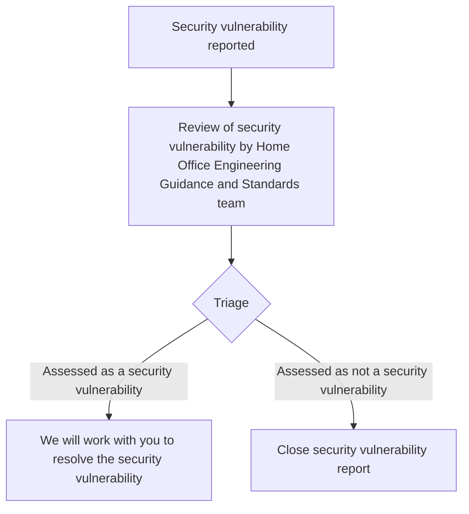

# Security Policy

## Report a security vulnerability

You can report a vulnerability to the Home Office Engineering Guidance and Standards team through the [repository's security advisory page](https://github.com/HO-CTO/engineering-guidance-and-standards/security/advisories/new).

Please enter as much information as possible in your report, this will help us better triage the vulnerability.

## What happens next

The below chart sets out the process once a security vulnerability is reported:

